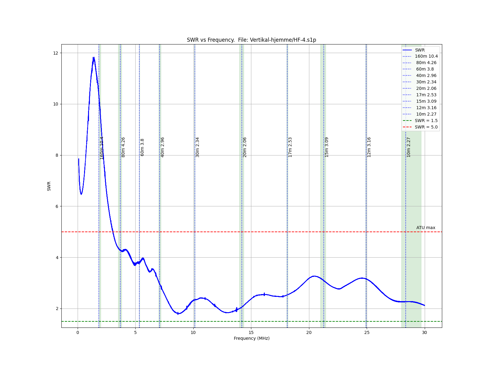

# Vertical antenna 

## Introduction

As I live in a chained townhouse (norwegian rekkehus) with a small garden I have no room for
a large antenna. Some long wire experiemnts have workded ok, but SWR and issues with multiple 
bands was always present. 

The vertical is 7 meters high and is a telescopic 
[fiber glass rod](https://www.biltema.no/fritid/hage/skadedyr-og-insekter/fugleskremsel-teleskopisk-2000041291).
At the base is a 1:9 unun with a grounding spike. The 0.75mm² cable is twisted with long turns up the rod, with a small
loop at the top (adding some extra capacity).

With 20m LMR-240 to the shack it works better than any of the random wire antennas.

The SWR is not quite good and well within the tuning range of the Xiegu G90. As expected with a very short 
vertical the lower bands suffer. 

The [Python script](https://github.com/olewsaa/amateur-radio/blob/main/NanoVNA/swr-Z)
used to produce this figure is found under the NanoVNA section.

